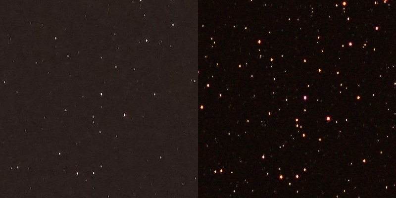
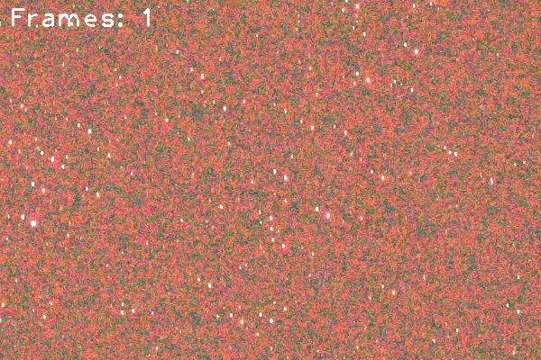

# StarStack
This simple python script allows users to combine a large number of photos of the night sky, without the need for equatorial tracking equipment. By combining many short exposures together, background noise can be reduced.

Before and after: (100% zoom, left is a 5 second exposure, 50 mm F/1.8 lens on a Sony Alpha 7 ii. Right is 120 exposures stacked.)

# Results

## TODO
-Remove dual jpg and RAW dependency
-Gamma curve adjustment for brightening image

# Usage Directions
Place desired images to be stacked in a folder in the same directory as stack.py, labeled "jpg". Run stack.py. The image registration will take roughly 30 seconds per image.
