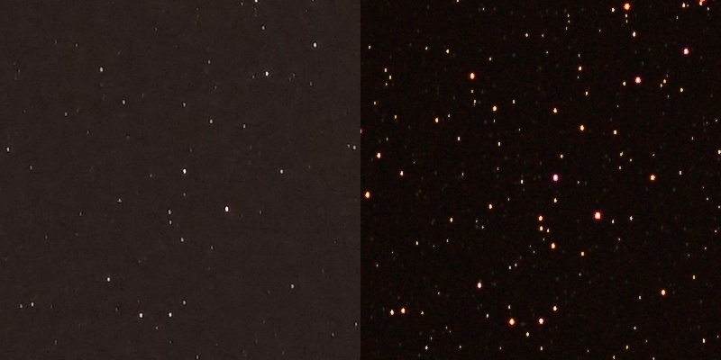
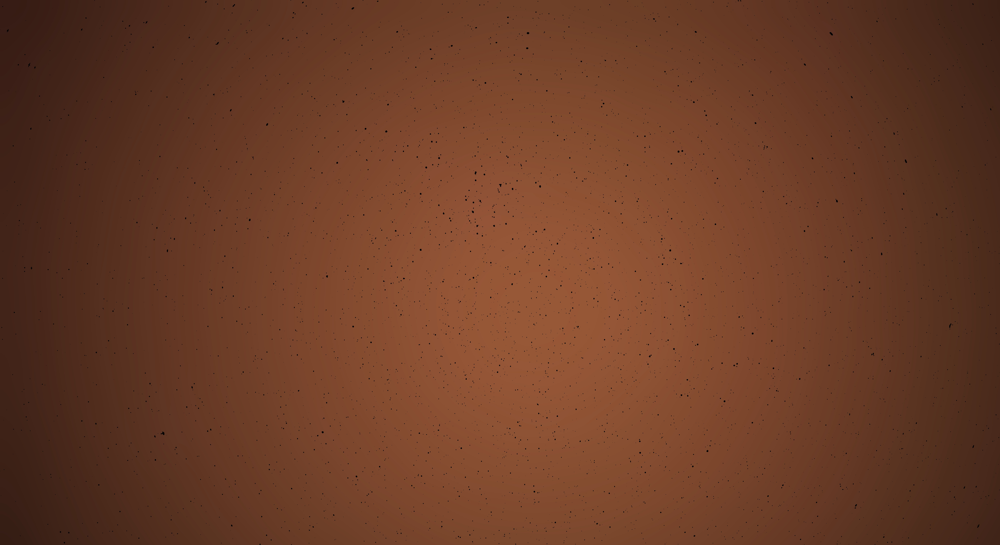
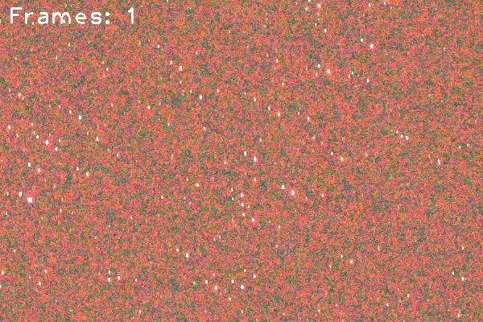

# StarStack
This simple python script allows users to combine a large number of photos of the night sky, without the need for equatorial tracking equipment. By combining many short exposures together, background noise can be reduced, giving the effect of a single, longer exposure.

Before and after: (100% zoom, left is a 5 second exposure, 50 mm F/1.8 lens on a Sony Alpha 7 ii. Right is 120 exposures stacked.)

# Theory
Due to its low light output, the night sky requires very long image exposure times to collect sufficient light. Unfortunately, trying to take one long exposure leads to star "trails" forming, due to the Earth's rotation. Long exposures also lead to increasing buildup of light pollution, washing out less prominent stars.

## Registration
The homography is found using the [Enhanced Correlation Coefficient](http://xanthippi.ceid.upatras.gr/people/evangelidis/george_files/PAMI_2008.pdf) algorithm, which is implemented in OpenCV. This method works well for the small change between each frame, because the previous frame's orientation can be given as an initial "guess."

## Light Pollution Subtraction
Most urban and suburban areas are subject to significant [light pollution](https://www.lightpollutionmap.info), making imaging faint night sky objects challenging. Fortunately, this light pollution tends to vary gradually and smoothly across the sky. A common technique to remove this pollution is to take a gaussian blur of the sky, and then subtract this image from the original. 

# Challenges
The most difficult part of this project was selecting the best algorithm to align exposures between successive exposures. I initially tried using [iterative closest point](https://en.wikipedia.org/wiki/Iterative_closest_point), which finds the alignment between two sets of points, not knowing how each point in the first set corresponds to that in the second set. I generated the 'points' for each frame as the brightest stars. I used a technique described in [Astromtery.net](https://arxiv.org/pdf/0910.2233.pdf): subtract the median pixel value from the image, and then look for the statistical outliers in the image, which correspond to pixels belonging to stars.

# Results
This gif shows a 100% crop of the center 200 x 300 pixels of the stacked image. As the number of frames averaged together increases, the noisiness of the background visibly decreases.

# Usage Directions
1. Place desired images to be stacked in a folder in the same directory as stack.py, labeled "jpg".
2. Install dependencies with `poetry install`.
3. Run `poetry run python -m starstack.stack`. The image registration will take roughly 30 seconds per image.

## Future Work
The enhanced correlation coefficient alignment step is the most expensive step in processing the images. It would be interesting to see how many iterations, or what error threshold epsilon, consistently leads to satisfactory stacking results.
